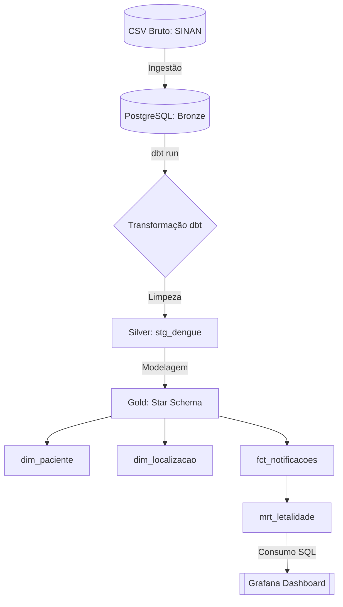
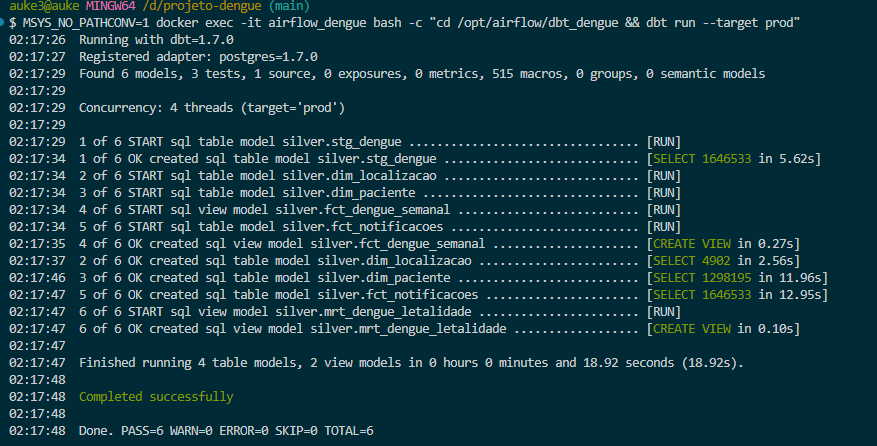
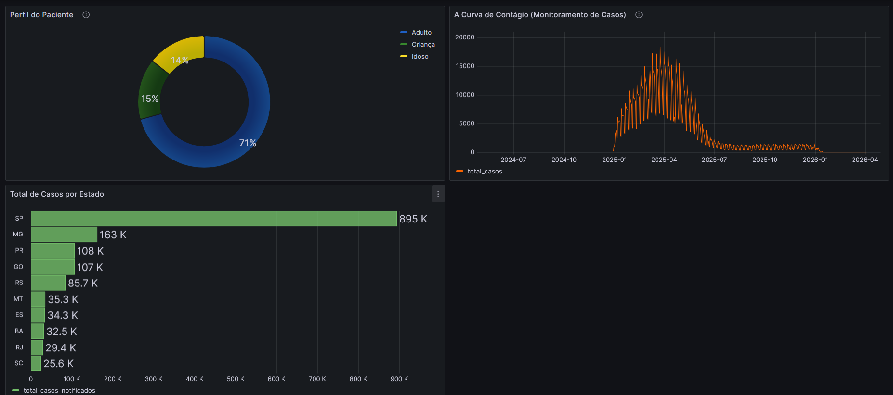

# 🚀 Data Engineering Project: Dengue Analytics (DataSUS)


## 📋 Sobre o Projeto
Este projeto implementa uma pipeline completa de Engenharia de Dados para análise epidemiológica da Dengue no Brasil, utilizando dados reais do SINAN (DataSUS). O objetivo foi transformar dados brutos e complexos em um **Dashboard Executivo** capaz de responder perguntas críticas sobre volumetria, perfis de pacientes e distribuição geográfica.

---

## 🏗️ Arquitetura e Fluxo de Dados
A arquitetura foi desenhada seguindo os princípios de **Modern Data Stack**, garantindo escalabilidade e separação de preocupações.



### 🔍 Processamento de Dados (Pipeline dbt)
Abaixo, a evidência do sucesso da pipeline de transformação, processando mais de 1.6 milhão de registros com sucesso:



* **Bronze (Ingestão):** Dados carregados via script para o PostgreSQL em seu estado bruto.
* **Silver (Limpeza via dbt):** Tratamento de valores nulos, limpeza de strings e padronização de datas.
* **Gold (Modelagem via dbt):** Construção do **Star Schema** para otimização de queries analíticas, utilizando *surrogate keys* via pacote `dbt_utils`.
* **Data Marts:** Camada final de agregação para consumo direto do BI.

---

## 📈 Dashboard Final e Resultados
O resultado final é um dashboard dinâmico que permite a análise em tempo real da evolução da epidemia:



### 📊 Insights Extraídos:
* **Epicentro da Crise:** O estado de **São Paulo (SP)** concentra o maior volume absoluto de notificações (895K+), seguido por Minas Gerais e Paraná.
* **Perfil de Risco (Quebra de Mito):** Contrariando a percepção comum de que a dengue afeta apenas os extremos de idade, **71% dos casos** afetam adultos (15-59 anos), indicando uma altíssima exposição da população em idade ativa.
* **Sazonalidade:** O pico crítico de contágio revelou-se concentrado entre os meses de Março e Maio, auxiliando na gestão de recursos hospitalares.

---

## 🛡️ Desafios Enfrentados e Soluções (Engineering Case)
Durante o desenvolvimento, enfrentei desafios reais comuns no manuseio de dados públicos:

### 1. O Mistério da Idade Codificada
* **Problema:** A base armazena a idade como um código composto (ex: `4025` para 25 anos, `3010` para 10 meses). Isto causou um erro de classificação onde quase 100% da base foi lida como "Idosos".
* **Solução:** Implementação de lógica matemática no SQL (`MOD(idade_codigo, 1000)`) para extrair a idade real e classificar corretamente as faixas etárias.

### 2. Dicionários de Dados Geográficos (IBGE vs. UF)
* **Problema:** O campo de estado continha apenas códigos numéricos do IBGE (ex: 35) em vez das siglas (ex: SP), tornando o dashboard pouco intuitivo.
* **Solução:** Criação de um mapeamento dinâmico (`CASE WHEN`) para traduzir os códigos geográficos em siglas legíveis diretamente na camada de visualização.

### 3. Otimização de Performance em Larga Escala
* **Problema:** Agregação de milhões de linhas diretamente no dashboard gerava lentidão nas consultas.
* **Solução:** Criação de uma **Data Mart** pré-agregada (`mrt_dengue_letalidade`), reduzindo o tempo de carregamento dos painéis para milissegundos.

---

## 🛠️ Como Executar o Projeto

### Pré-requisitos
* Git
* Docker e Docker Compose

### Passo a Passo
1.  **Clone o repositório:**
    ```bash
    git clone [https://github.com/bigauke/projeto-dengue-2025.git](https://github.com/bigauke/projeto-dengue-2025.git)
    cd projeto-dengue-2025
    ```
2.  **Suba o ambiente Docker:**
    ```bash
    docker-compose up -d
    ```
3.  **Execute as transformações do dbt:**
    ```bash
    docker exec -it airflow_dengue bash -c "cd /opt/airflow/dbt_dengue && dbt run --target prod"
    ```
4.  **Acesse o Dashboard:**
    * **URL:** `http://localhost:3000`
    * **Importação:** Importe o JSON localizado em: `/dashboards/dashboards_dengue_2025.json`

---

## 👨‍💻 Autor
**Daniel Linhares**
* Analista e Engenheiro de Dados
* **LinkedIn:** [linkedin.com/in/daniel-linhares-analista](https://www.linkedin.com/in/daniel-linhares-analista/)
* **E-mail:** danielinhares@gmail.com